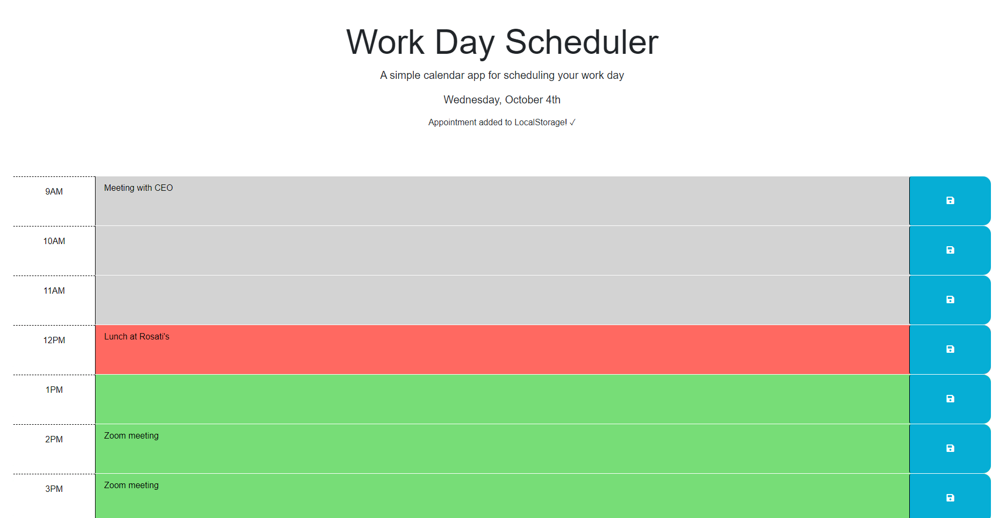

# Work Day Scheduler

## Description

A lightweight site designed to offer you a simple way to schedule events throughout your working day. Color coordinated rows also visually cue you as to the flow for your time as you are focused on other things. Information about events are not shared between devices, but utilize the local storage on one device.

## Installation

No installation is necessary! Follow the following links to the github repository and live site.

Github repository: https://github.com/kurtriecken/Work-day-scheduler

Deployed site: https://kurtriecken.github.io/Work-day-scheduler

## Usage

Below is screenshot of the deployed website. 

A series of 9 bars are laid out on the page to represent the 9 hours between 9AM and 6PM of the standard working day. The date is located at the top of the screen and is refreshed every 15 minutes without a page load.

To get started, simply type the event you need to schedule into the middle of the desired hour row. Then, click the blue save icon on the right side of that row. A message will pop up at the top of the screen indicating that your event was saved to the local storage on your device. If you happen to lose internet or close the page, don't worry! The event will be in the correct row the next time you visit the site.

Hours are also color-coordinated according to the following schema:

| Time      | Color |
| ----------- | ----------- |
| Past      | Gray       |
| Present   | Red        |
| Future   | Green        |

If you have any questions or if my site does not function properly on your device, please contact me here on GitHub.

## Credits

Refactored by kurtriecken (github.com/kurtriecken)

## License

MIT license